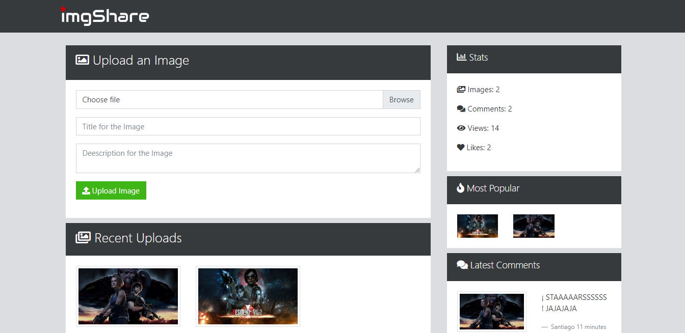

## ImgShare

image network, you can share your image and do comments about there

## How to use?

Require Node.JS 10

- `npm run install`
- `npm run dev`

## URL web

- `https://images-network.herokuapp.com/`
